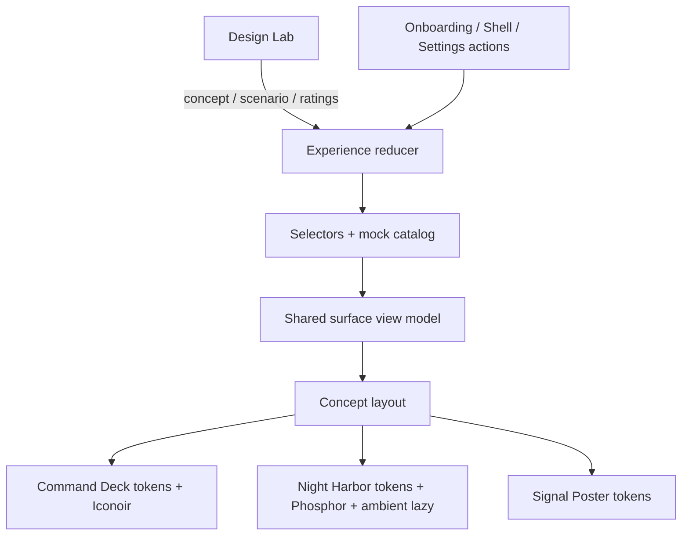

# Plan — Configurações, onboarding e Design Lab

## Approach

Substituir o placeholder do renderer por uma demonstração React inteiramente local,
dirigida por um único modelo de sessão e um único catálogo de conteúdo/ações. A camada
funcional produz um view model sem conhecimento de conceito visual; uma camada de
apresentação aplica tokens, layout e motion de Command Deck, Night Harbor ou Signal
Poster. O Design Lab atua acima do shell do produto e modifica apenas dimensões do
experimento. Não haverá mudança em main, preload, IPC, storage, credenciais ou qualquer
API privilegiada.

O plano adota reducer + Context do React, layouts finos por slots, CSS custom properties,
CSS Modules e primitives acessíveis sem estilo. Motion permanece híbrido: CSS resolve
estados simples; `motion/react` resolve continuidade/layout; `shaders/react` fornece
somente o ambiente lazy e degradável de Night Harbor. As decisões técnicas foram
resolvidas; o documento permanece draft até a aprovação final do plano.

## Arquitetura



O fluxo de dados é unidirecional. `DesignLab` e as telas despacham ações tipadas; o
reducer produz a sessão; seletores combinam sessão e fixtures em um view model; o conceito
escolhido apresenta esse mesmo modelo. Nenhum componente de conceito pode disparar uma
ação que não exista no catálogo compartilhado.

### Limites

- Alterações restritas a `src/renderer/`, testes do renderer, configuração Vitest,
  `package.json` e lockfile para as dependências aprovadas.
- `src/main/`, `src/preload/`, `src/shared/ipc.ts`, SQLite, keychain e scripts de native
  addons permanecem intocados.
- Sem `localStorage`, `sessionStorage`, cookies, query string ou gravação em disco.
- Sem chamadas de rede em runtime. Recursive Variable e sua licença OFL são assets locais.
- Sem React Router: os destinos são estados da demonstração e não têm requisito de URL.
- O Design Lab é isolado em um módulo removível; telas do produto conhecem apenas seu
  ponto de entrada compartilhado.

## Components & changes

| Component | Change | Notes |
| --- | --- | --- |
| `src/renderer/src/App.tsx` | modify | Monta provider, `MotionConfig reducedMotion="user"`, camada do experimento, superfície e toast. |
| `src/renderer/src/app/experience-model.ts` | create | Tipos, estado inicial, reducer, ações e invariantes. |
| `src/renderer/src/app/ExperienceProvider.tsx` | create | Contexts separados de estado/dispatch e hooks de acesso. |
| `src/renderer/src/app/mock-catalog.ts` | create | Fixtures imutáveis em inglês e conteúdo dos quatro cenários. |
| `src/renderer/src/app/selectors.ts` | create | Constrói view models por superfície sem conhecer o conceito. |
| `src/renderer/src/app/use-reduced-motion.ts` | create | Combina preferência do sistema e `useReducedMotion` de Motion; fallback seguro em teste. |
| `src/renderer/src/design-lab/DesignLab.tsx` | create | Dock lateral recolhível, conceito, cenário, sliders 0–10 e favorita. |
| `src/renderer/src/design-lab/DesignLabRail.tsx` | create | Rail de 88 px que mantém conceito/cenário identificáveis quando recolhido. |
| `src/renderer/src/onboarding/` | create | Sequência de quatro etapas; draft preservado, Back/Continue/Skip explícitos. |
| `src/renderer/src/shell/` | create | Navegação principal e destinos Overview, Projects, Sessions, Issues e Settings. |
| `src/renderer/src/settings/` | create | Cinco categorias e entrada para o mesmo Design Lab em Appearance & motion. |
| `src/renderer/src/scenarios/` | create | Ready, loading, empty e error presenters compartilhados. |
| `src/renderer/src/ui/` | create | Button, field, status, skeleton, empty/error panel, Base UI wrappers, toast e ícone semânticos. |
| `src/renderer/src/concepts/` | create | Registry e três layouts finos por slots compartilhados. |
| `src/renderer/src/concepts/night-harbor/NightAmbient.tsx` | create | Boundary lazy de um generator de `shaders/react`, canvas único e fallback CSS. |
| `src/renderer/src/styles/` | create | Reset, tokens semânticos, estilos por conceito, motion e regras responsivas. |
| `src/renderer/src/assets/fonts/` | create | Recursive Variable WOFF2 local e licença OFL. |
| `src/renderer/src/main.tsx` | modify | Importa estilos globais; mantém StrictMode. |
| `vitest.config.ts` | modify | Preserva testes native em Node e habilita jsdom + setup de jest-dom apenas no renderer. |
| `tests/renderer/` | create | Reducer, comportamento, montagem parametrizada e acessibilidade estrutural. |
| `package.json` | modify | Adiciona cinco dependências runtime e quatro devDependencies aprovadas. |
| `package-lock.json` | modify | Registra exatamente a resolução das dependências aprovadas. |

## Data & contracts

### Identificadores fechados

```ts
type ConceptId = 'command-deck' | 'night-harbor' | 'signal-poster'
type ScenarioId = 'default' | 'loading' | 'empty' | 'error'
type OnboardingStep =
  | 'welcome'
  | 'installed-agents'
  | 'issue-integrations'
  | 'first-project'
type ShellDestination =
  | 'overview'
  | 'projects'
  | 'sessions'
  | 'issues'
  | 'settings'
type SettingsCategory =
  | 'general'
  | 'appearance-motion'
  | 'agents'
  | 'integrations'
  | 'notifications'
type RatingMetric = 'clarity' | 'personality' | 'density' | 'motion'
type RatingValue = 0 | 1 | 2 | 3 | 4 | 5 | 6 | 7 | 8 | 9 | 10
```

Esses nomes são internos e estáveis. Os rótulos visíveis vêm de um catálogo em inglês.
Não há identificador externo que possa ser renomeado por Electron ou pelo sistema
operacional.

### Sessão

```ts
interface ExperienceState {
  phase: 'onboarding' | 'shell'
  onboardingStep: OnboardingStep
  shellDestination: ShellDestination
  settingsCategory: SettingsCategory
  concept: ConceptId
  scenario: ScenarioId
  onboardingDraft: OnboardingDraft
  settingsDraft: SettingsDraft
  assessments: Record<ConceptId, Partial<Record<RatingMetric, RatingValue>>>
  favoriteConcept: ConceptId | null
  toast: ToastMessage | null
}
```

- O estado inicial sempre abre `welcome`, `command-deck`, `default`, sem favorita.
- `onboardingDraft` guarda seleções simuladas independentemente de passo ou conceito.
- `assessments` é por conceito; trocar o conceito não mistura notas.
- A favorita é uma preferência de avaliação, não muda `concept`.
- `settingsDraft` demonstra controles locais, sem alegar salvamento.
- Reload remonta o provider e recria o estado inicial.

`RatingValue` é inteiro de 0 a 10. O reducer rejeita valores fracionários ou fora do
intervalo, mesmo que a primitive de Slider já use `min=0`, `max=10` e `step=1`.

### Ações e invariantes

O reducer expõe uma union discriminada, incluindo:

- `goToOnboardingStep`, `updateOnboardingDraft`, `completeOnboarding`;
- `goToDestination`, `selectSettingsCategory`;
- `selectConcept`, `selectScenario`;
- `updateAssessment`, `selectFavorite`;
- `updateSetting`, `showToast`, `dismissToast`;
- `recoverScenario`.

Invariantes obrigatórias:

1. `selectConcept` não altera passo, destino, categoria, cenário ou dados.
2. `selectScenario` não altera conceito ou navegação.
3. navegação não altera avaliações/favorita.
4. Skip marca somente a escolha correspondente; nunca remove o caminho de continuação.
5. `completeOnboarding` entra em Overview com fixtures ou no vazio útil quando First
   project foi adiado.
6. `recoverScenario` volta o cenário corrente para `default`, preservando sessão e
   navegação.
7. ações destinadas a controles desabilitados não são despachadas.

### Conteúdo e cenários

O catálogo contém dados base uma única vez: projeto atual, sessões, issues, consumo,
atividade, agentes, integrações e preferências. O seletor de cenário devolve um contrato
discriminado:

```ts
type ScenarioSlice<T> =
  | { status: 'ready'; data: T }
  | { status: 'loading'; label: string }
  | { status: 'empty'; title: string; guidance: string; action?: SharedAction }
  | { status: 'error'; title: string; cause: string; recovery: SharedAction }
```

Loading é determinístico, não depende de timers nem rede, e preserva saídas seguras.
Empty explica a ausência e propõe uma ação pertinente. Error sempre nomeia causa e
recuperação. Os mesmos contratos alimentam os três conceitos.

### Feedback, foco e semântica

- Toasts não críticos usam `role="status"`/`aria-live="polite"`, não recebem foco e
  somem após quatro segundos; testes usam relógio falso.
- Erros usam `role="alert"` e incluem texto + ação, nunca apenas cor.
- Controles simples usam elementos nativos. Slider, tooltip, toast e demais primitives
  complexas podem usar `@base-ui/react`, preservando nome, valor e estado acessíveis.
  Atributos `disabled`, `aria-current`, `aria-selected`, `aria-expanded`,
  `aria-controls` e `aria-valuetext` são expostos conforme o papel.
- Após passo, destino ou categoria mudar, o heading principal recebe foco programático
  com `tabIndex={-1}`. O foco retorna ao gatilho ao fechar o Design Lab.
- Há skip link para o conteúdo principal no shell.
- Alvos primários mantêm caixa acionável mínima de 44×44 px.

## Presentation system

### Resolved (C) — layouts finos por slots compartilhados

Seções, conteúdo, controles e ações são componentes compartilhados; cada conceito
fornece somente um `ConceptLayout` que posiciona slots como `primary`, `metrics`,
`queue`, `activity` e `utility`. Testes parametrizados exigem os mesmos slots e ações em
cada layout. A ordem DOM permanece coerente com leitura/teclado; CSS Grid não reordena
interativos de forma conflitante.

CSS Modules isolam componentes, CSS custom properties mapeiam tokens semânticos e
`@base-ui/react` fornece apenas primitives complexas sem estilo. Não serão adotados
shadcn nem componentes pré-estilizados.

### Tokens semânticos

Componentes consomem papéis como `--canvas`, `--surface`, `--surface-raised`, `--ink`,
`--ink-muted`, `--accent`, `--danger`, `--border`, `--focus-ring`, `--radius-*`,
`--space-*`, `--type-*`, `--duration-*` e `--ease-*`. Hex, radius e shadow não aparecem
em componentes.

Paletas de partida, sujeitas a ajuste mecânico para contraste:

| Conceito | Canvas | Surface | Ink | Muted | Accent | Secondary |
| --- | --- | --- | --- | --- | --- | --- |
| Command Deck | `#F2F4F7` | `#FFFFFF` | `#111827` | `#4B5563` | `#0B6B5B` | `#1D4ED8` |
| Night Harbor | `#07111F` | `#0E1B2F` | `#F3F7FF` | `#AABBD1` | `#63A9FF` | `#B69CFF` |
| Signal Poster | `#D9CCFF` | `#F6F1FF` | `#111111` | `#3B3347` | `#5A31D6` | `#FFFFFF` |

Cada par texto/superfície deve ser medido em AA (4.5:1 para texto normal; 3:1 para texto
grande e componentes gráficos), não inferido pela aparência.

### Assinatura por conceito

- **Command Deck:** painel claro de instrumentação, ritmo 4/8 px, bordas finas,
  tipografia compacta e numerais tabulares. A assinatura é uma faixa de telemetria que
  conecta projeto, sessões e fila sem esconder as ações próximas.
- **Night Harbor:** módulos escuros com azul/lilás, profundidade contida e uma única
  transição espacial entre contextos. A assinatura é um campo ambiental inspirado em
  radar portuário, sempre atrás do conteúdo e sem codificar dados.
- **Signal Poster:** grid retangular preto/lavanda, masthead de escala deliberadamente
  grande, regras duras e pouca profundidade. A assinatura é o nome da área atual tratado
  como um cartaz operacional; o risco tipográfico é contido para não empurrar ações
  essenciais para fora de 1024×700.

Isso evita três defaults genéricos detectados na crítica de design: gradiente SaaS,
glassmorphism decorativo e cards idênticos apenas recoloridos.

### Motion, shader e movimento reduzido

- CSS resolve hover, focus, pressed, skeleton e transições simples.
- `motion`, importado por `motion/react`, fornece `AnimatePresence`, layout animation e
  continuidade entre contextos onde isso acrescenta orientação real.
- A raiz usa `MotionConfig reducedMotion="user"`; componentes que decidem montagem usam
  `useReducedMotion()`.
- Command Deck usa feedbacks de 120–180 ms e atualização pontual, sem ambiente animado.
- Night Harbor usa entrada/saída de 220–320 ms, no máximo dois elementos em movimento e
  um `NightAmbient` lazy.
- Signal Poster usa cortes/crossfades de 80–140 ms, sem simular profundidade.
- Nenhuma animação bloqueia input ou anima width/height/top/left.
- `@media (prefers-reduced-motion: reduce)` continua como segunda barreira e remove
  transforms, staggers e smooth scroll.
- Relação causal e estado permanecem expressos por texto, posição e semântica.

`NightAmbient` importa `shaders/react` de forma lazy apenas quando Night Harbor está
ativo, o movimento não está reduzido e a área é visível. Ele renderiza um único canvas
com um generator barato, `aria-hidden`, `pointer-events: none`, atrás do conteúdo, sem
cursor trail e sem representar dados. Ao trocar de conceito, usa `visible={false}` quando
o ciclo de saída precisar concluir e depois desmonta; fora disso, desmonta imediatamente.
Se WebGPU não estiver disponível, a biblioteca pode usar WebGL2; se nenhum backend
funcionar, o boundary mantém um fallback CSS estático. Canvas, resolução/RTT e efeitos
ficam limitados, pois o custo cresce com essas dimensões.

### Responsividade desktop

Usar breakpoints de capacidade, não de dispositivo: baseline em 1024×700 e expansão em
1440×900. Em 1024, módulos podem empilhar verticalmente, a navegação reduz whitespace e
o Design Lab permanece acessível sem rolagem horizontal. Em 1440, Overview mostra os
cinco grupos em uma grade legível. Não há regras mobile nem colapso para viewport menor
que 1024.

## Design Lab

### Resolved (B) — dock lateral recolhível e sliders 0–10

O Design Lab ocupa uma coluna própria no grid da aplicação: rail recolhido de 88 px e
painel aberto de 320 px. Ele nunca sobrepõe o produto. Em 1024×700, abrir o dock aciona o
layout compacto e empilha módulos secundários; ações essenciais permanecem alcançáveis
por scroll vertical, sem corte ou rolagem horizontal.

O rail recolhido exibe `Lab`, um nome curto do conceito (`Deck`, `Night`, `Signal`) e o
cenário corrente em texto, não somente cor ou ícone. O botão expõe `aria-expanded` e
`aria-controls`; Escape recolhe e devolve foco ao gatilho. `Appearance & motion` abre e
foca esse mesmo painel, sem segundo store.

Cada métrica usa Slider de Base UI, inteiro de 0 a 10, com label visível, valor numérico
persistente, rótulos de extremos, `aria-valuemin`, `aria-valuemax`, `aria-valuenow` e
`aria-valuetext`. Setas ajustam 1 ponto; Home/End vão a 0/10. Ratings e favorita seguem
associados ao conceito avaliado.

## Assets

### Resolved — Recursive Variable offline e duas famílias de ícones

Recursive Variable será vendorizada em WOFF2 com licença OFL e carregada via
`@font-face` local com `font-display: swap`; não há fetch runtime. Os conceitos variam
os eixos da mesma família:

- Command Deck: `CASL` baixo, peso 400–650 e `MONO` parcial/total para dados.
- Night Harbor: `CASL` intermediário, peso 350–650 e mono para labels técnicos.
- Signal Poster: `CASL` alto, peso 500–900 e mono total para legendas/dados.

A iconografia usa duas dependências, sem misturar famílias na mesma camada:

- **Command Deck:** Iconoir, traço preciso e técnico.
- **Night Harbor:** Phosphor Regular, módulos espaciais com silhueta legível.
- **Signal Poster:** Phosphor Bold, presença gráfica compatível com o grid editorial.
- **Chrome do Design Lab:** Iconoir, pois é uma camada experimental separada do produto.

Ícones decorativos são `aria-hidden`; botões icon-only recebem nome acessível; nenhum
emoji atua como ícone estrutural. A metáfora de cada ação permanece igual nos conceitos,
mesmo quando a família visual muda.

## Testing

### Resolved (A) — Testing Library completo

- `jsdom` — DOM para Vitest;
- `@testing-library/react` — render e queries semânticas;
- `@testing-library/user-event` — interação realista de teclado/clique;
- `@testing-library/jest-dom` — assertions de estado/semântica legíveis.

São quatro dependências somente de desenvolvimento, agrupadas porque, juntas, atendem
a cobertura comportamental e de montagem exigida pela constitution. Testes renderer
usam jsdom; o smoke native existente continua em ambiente Node/Electron. Nenhuma
dependência E2E é adicionada.

### Dependências aprovadas

| Tipo | Pacote | Papel |
| --- | --- | --- |
| runtime | `motion` | `motion/react`, presença, layout e reduced motion. |
| runtime | `shaders` | `shaders/react` lazy para o único ambiente de Night Harbor. |
| runtime | `@base-ui/react` | Primitives complexas acessíveis e sem estilo. |
| runtime | `@phosphor-icons/react` | Ícones de Night Harbor e Signal Poster. |
| runtime | `iconoir-react` | Ícones de Command Deck e chrome do Design Lab. |
| dev | `jsdom` | Ambiente DOM dos testes renderer. |
| dev | `@testing-library/react` | Render e queries semânticas. |
| dev | `@testing-library/user-event` | Teclado e ponteiro realistas. |
| dev | `@testing-library/jest-dom` | Matchers de DOM/semântica. |

Não adicionar Framer Motion como pacote separado: `motion` é o pacote aprovado e os
imports React vêm de `motion/react`.

### Cobertura automatizada

| Evidência | Cobertura principal |
| --- | --- |
| Testes puros do reducer e seletores | AC-008–AC-010, AC-013–AC-016, AC-038 |
| Testes do onboarding com user-event | AC-001–AC-005, AC-014, AC-018 |
| Testes de shell/settings | AC-006–AC-007, AC-011–AC-012, AC-017–AC-018 |
| Testes de cenários parametrizados | AC-009, AC-012, AC-017, AC-022–AC-025 |
| Testes semânticos/teclado/foco | AC-018, AC-030–AC-032, AC-036 |
| Smoke mount 3 conceitos × 3 superfícies × 4 cenários | AC-013, AC-037 |
| Reload por remontagem do provider | AC-016 |

Testes não alegam provar layout, contraste, qualidade visual, área real de hit target ou
motion; essas propriedades permanecem no roteiro manual.

## Manual verification

Executar a aplicação pelo task `npm run dev` e registrar uma grade de evidências:

1. Capturas comparáveis em 1440×900 para onboarding, Overview e Settings nos três
   conceitos com o mesmo estado Default.
2. Passagem em 1024×700 por 3 conceitos × 3 superfícies × 4 cenários, verificando
   clipping, sobreposição, acesso às ações e ausência de scroll horizontal.
3. Jornada completa somente por teclado, incluindo Back/Skip/Continue, cinco destinos,
   cinco categorias, Design Lab, ratings, favorita, recuperação e retorno de foco.
4. Inspeção da árvore de acessibilidade e, quando disponível, leitor de tela para nomes,
   papéis, current/selected/expanded/disabled, alertas e toast.
5. Repetição com reduced motion ativo no sistema/DevTools: `NightAmbient` não montado,
   transições simplificadas e nenhuma perda de conteúdo.
6. Medição de contraste e caixas de interação; alvos primários >=44×44 px.
7. Reload após alterações para confirmar reset e ausência de alegação de persistência.
8. Night Harbor com WebGPU e fallback WebGL2 quando disponível, observando canvas único,
   ausência de cursor trail, fallback CSS e desmontagem ao trocar de conceito.
9. Dock aberto/recolhido em 1024×700, confirmando indicador de conceito/cenário, sliders
   por teclado e ausência de ações cobertas.

O roteiro deve marcar cada AC manual como aprovado/reprovado e anexar observação ou
captura; uma amostra visual não substitui a matriz completa.

## Decisions (ADRs)

- [ADR-0001](adr/0001-modelo-de-sessao-efemero-compartilhado.md) — reducer e Context
  compartilhados, efêmeros e renderer-only.
- [ADR-0002](adr/0002-layouts-por-slots-e-motion-ambiental.md) — layouts finos,
  sistema visual, Motion e shader ambiental limitado.
- [ADR-0003](adr/0003-design-lab-dock-e-escala.md) — dock lateral recolhível e
  avaliações inteiras de 0 a 10.
- [ADR-0004](adr/0004-recursive-e-iconografia-por-conceito.md) — Recursive offline e
  atribuição coerente das duas famílias de ícones.
- [ADR-0005](adr/0005-harness-react-jsdom.md) — Testing Library/jsdom e separação do
  smoke native.

## Risks

- **Drift funcional entre conceitos** → view model, ações, slots e smoke matrix
  compartilhados; nenhum estado dentro do adaptador visual.
- **Matriz de estados explode em duplicação** → fixtures base + `ScenarioSlice<T>` e
  testes parametrizados.
- **Ordem visual diverge da ordem de foco** → DOM semântico compartilhado e proibição de
  reordenar interativos apenas por CSS.
- **Dock reduz demais o conteúdo em 1024×700** → coluna não sobreposta, layout compacto,
  empilhamento vertical e teste com dock aberto/recolhido.
- **Tipografia editorial causa overflow** → type scale responsiva limitada por `clamp`
  e teste com zoom/texto ampliado.
- **Motion prejudica conforto ou input** → máximo de dois elementos, transform/opacity,
  `MotionConfig`, media query e `useReducedMotion` que impede montar o ambiente.
- **Shader aumenta GPU, bundle ou falha no backend** → import lazy, generator barato,
  canvas único, RTT/resolução limitados, WebGL2 e fallback CSS estático.
- **Duas famílias de ícones geram inconsistência** → registry por conceito/camada e
  proibição de importar as duas no mesmo presenter.
- **Recursive causa FOIT ou variação inesperada** → WOFF2 local, `font-display: swap`,
  fallback métrico e smoke offline.
- **Contraste autoral falha AA** → pares tokenizados medidos por conceito antes da
  evidência visual.
- **Toast ou navegação perdem foco** → região live sem foco e heading focado apenas nas
  transições exigidas.
- **jsdom interfere no smoke native** → seleção de ambiente por arquivo/pasta; teste
  Electron existente permanece Node.
- **Design Lab vaza para produto permanente** → módulo, estado e chrome explicitamente
  isolados e sem persistência.

## Verification approach

Antes de reportar sucesso, executar os tasks `npm run lint`, `npm run typecheck` e
`npm run test` como verify gate. Executar também `npm run build` para detectar falhas de
assets/CSS no bundle do renderer. O PASS técnico exige:

- reducer e invariantes cobertos;
- testes comportamentais e smoke matrix verdes;
- smoke native existente preservado;
- build do renderer sem fetch/runtime externo;
- bundle confirma chunk lazy do shader e ausência de `lucide-react`;
- roteiro manual completo com evidência para todos os ACs
  `requires-manual-verify: true`.

Não se adiciona Playwright nesta issue: ADR 0009 mantém E2E opcional, e o objetivo visual
é melhor atendido por Electron real + roteiro humano nesta fase.
